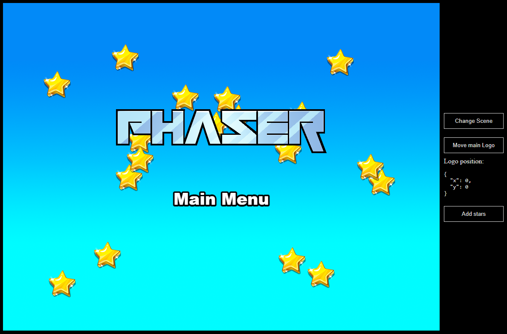

# Phaser Vue Template

This is a Phaser 3 project template that uses Vue framework. It supports hot-reloading for quick development workflow and includes scripts to generate production-ready builds.

### Versions

This template has been updated for:

- [Phaser 3.70.0](https://github.com/phaserjs/phaser)
- [Vue 3.4.15](https://github.com/vuejs)
- [Vite 5.0.11](https://github.com/vitejs/vite)



## Requirements

[Node.js](https://nodejs.org) is required to install dependencies and run scripts via `npm`.

## Available Commands

| Command | Description |
|---------|-------------|
| `npm install` | Install project dependencies |
| `npm run dev` | Launch a development web server |
| `npm run build` | Create a production build in the `dist` folder |

## Writing Code

After cloning the repo, run `npm install` from your project directory. Then, you can start the local development server by running `npm run dev`.

The local development server runs on `http://localhost:8080` by default. Please see the Vite documentation if you wish to change this, or add SSL support.

Once the server is running you can edit any of the files in the `src` folder. Vite will automatically recompile your code and then reload the browser.

## Template Project Structure

We have provided a default project structure to get you started. This is as follows:

- `index.html` - A basic HTML page to contain the game.
- `src` - Contains the Vue source code.
- `src/main.js` - The main **Vue** entry point. This bootstraps the Vue application.
- `src/App.vue` - The main Vue component.
- `src/game/PhaserGame.vue` - The Vue component that initializes the Phaser Game and serve like a bridge between Vue and Phaser.
- `src/game/EventBus.js` - A simple event bus to communicate between Vue and Phaser.
- `src/game` - Containts the game source code.
- `src/game/main.js` - The main **game** entry point. This contains the game configuration and start the game.
- `src/game/scenes/` - The Phaser Scenes are in this folder.
- `public/style.css` - Some simple CSS rules to help with page layout.
- `public/assets` - Contains the static assets used by the game.

## Vue Bridge

The `PhaserGame.vue` component is the bridge between Vue and Phaser. It initializes the Phaser game and handles the communication between Vue and Phaser.

To communicate between Vue and Phaser, you can use the **EventBus.js** file. This is a simple event bus that allows you to emit and listen for events in both Vue and Phaser.

```js
// In Vue
import { EventBus } from './EventBus.js'

// Emit an event
EventBus.emit('event-name', data)

// In Phaser
// Listen for an event
EventBus.on('event-name', (data) => {
    // Do something with the data
});
```

Futhermore PhaserGame component has exposed the game instance and the current scene instance to the Vue component (defineExpose({ scene, game })). You can access them like state reference (ref) or you can get the current scene like component event "current-active-scene".

**Important**: To expose some scene you need to add the emit event "current-scene-ready" using the EventBus in your phaser scene class.

```js
class MyScene extends Phaser.Scene {
    constructor() {
        super({ key: 'MyScene' });
    }

    create() {
        // Game Objects and logic
        ...
        // End line of the create method
        EventBus.emit('current-scene-ready', this);
    }
    ...
}
```

Component usage example:
```js
// In some parent component
<script setup>
import { ref, toRaw } from 'vue';

const phaser_ref = ref(); // will contain the game instance and the current scene instance, you can access them like toRaw(phaser_ref.value.game) or toRaw(phaser_ref.value.scene)

const onCurrentActiveScene = (scene) => {
    // Do something with the scene
}

</script>
<template>
  <PhaserGame ref="phaser_ref" @current-active-scene="onCurrentActiveScene" />
</template>

```

## Handling Assets

Vite supports loading assets via JavaScript module `import` statements.

This template provides support for both embedding assets and also loading them from a static folder. To embed an asset, you can import it at the top of the JavaScript file you are using it in:

```js
import logoImg from './assets/logo.png'
```

To load static files such as audio files, videos, etc place them into the `public/assets` folder. Then you can use this path in the Loader calls within Phaser:

```js
preload ()
{
    //  This is an example of an imported bundled image.
    //  Remember to import it at the top of this file
    this.load.image('logo', logoImg);

    //  This is an example of loading a static image
    //  from the public/assets folder:
    this.load.image('background', 'assets/bg.png');
}
```

When you issue the `npm run build` command, all static assets are automatically copied to the `dist/assets` folder.

## Deploying to Production

After you run the `npm run build` command, your code will be built into a single bundle and saved to the `dist` folder, along with any other assets your project imported, or stored in the public assets folder.

In order to deploy your game, you will need to upload *all* of the contents of the `dist` folder to a public facing web server.

## Customizing the Template

### Vite

If you want to customize your build, such as adding plugin (i.e. for loading CSS or fonts), you can modify the `vite/config.*.mjs` file for cross-project changes, or you can modify and/or create new configuration files and target them in specific npm tasks inside of `package.json`. Please see the [Vite documentation](https://vitejs.dev/) for more information.

## Join the Phaser Community!

We love to see what developers like you create with Phaser! It really motivates us to keep improving. So please join our community and show-off your work 😄

**Visit:** The [Phaser website](https://phaser.io) and follow on [Phaser Twitter](https://twitter.com/phaser_)<br />
**Play:** Some of the amazing games [#madewithphaser](https://twitter.com/search?q=%23madewithphaser&src=typed_query&f=live)<br />
**Learn:** [API Docs](https://newdocs.phaser.io), [Support Forum](https://phaser.discourse.group/) and [StackOverflow](https://stackoverflow.com/questions/tagged/phaser-framework)<br />
**Discord:** Join us on [Discord](https://discord.gg/phaser)<br />
**Code:** 2000+ [Examples](https://labs.phaser.io)<br />
**Read:** The [Phaser World](https://phaser.io/community/newsletter) Newsletter<br />

Created by [Phaser Studio](mailto:support@phaser.io). Powered by coffee, anime, pixels and love.

The Phaser logo and characters are &copy; 2011 - 2024 Phaser Studio Inc.

All rights reserved.
